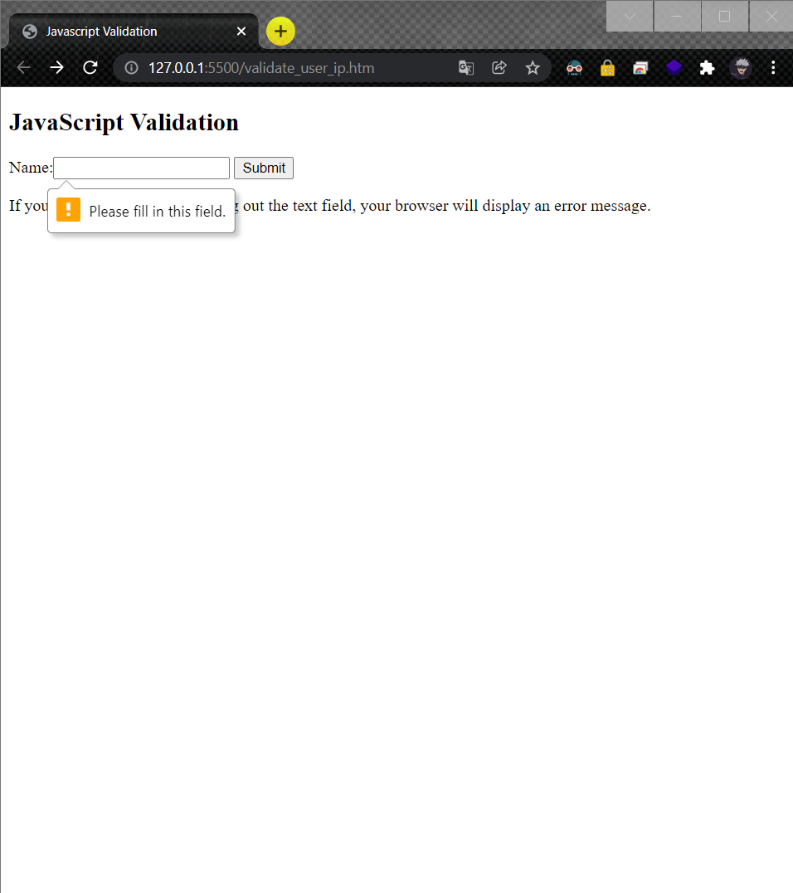

# Validate-user-input

## AIM
To Write Javascript to validate user input

# ALGORITHM
### STEP 1
create a simple html page using heading tag
### STEP 2
Add a form tag to the program
### STEP 3
Add action attribute and method="POST"
### STEP 4
Execute the program

# CODE
~~~
<!DOCTYPE html>
<html lang="en">
<head>
    <meta charset="UTF-8">
    <meta http-equiv="X-UA-Compatible" content="IE=edge">
    <meta name="viewport" content="width=device-width, initial-scale=1.0">
    <title>Javascript Validation</title>
</head>
<body>
    <h2>JavaScript Validation</h2>

<form action="/action_page.php" method="post">
  Name:<input type="text" name="fname" required>
  <input type="submit" value="Submit">
</form>

If you click submit, without filling out the text field,
your browser will display an error message.

</body>
</html>
~~~
# OUPUT

# RESULT
Javascript to Validate user input was successfully executed.